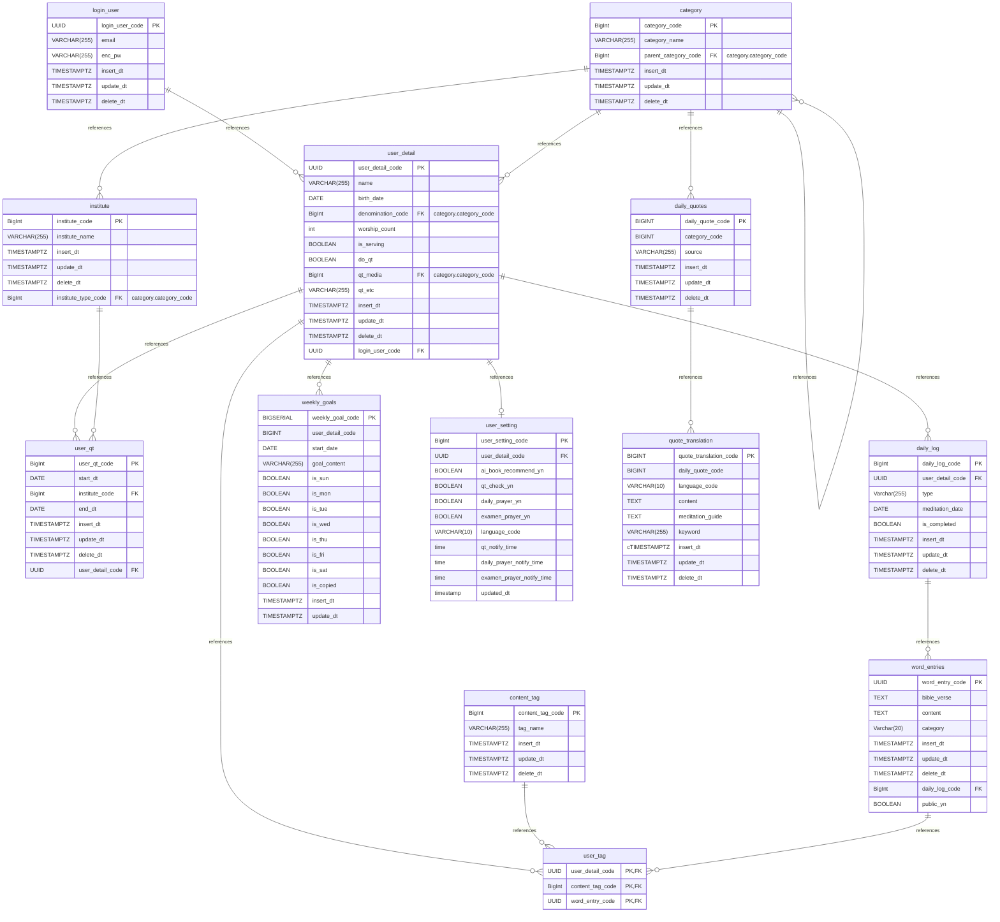

# Daily Word Log 

> **Personal Faith & Daily Meditation Tracking Web Application**  
> A mobile-friendly web application designed to capture daily Scripture verses, personal reflections, and prayer notes—helping users track spiritual growth, manage weekly habits, and explore keyword trends over time.

**[Service Link]** https://daily-word-project.vercel.app/

---

## Background & Motivation
- **The Problem:** Writing quiet time (QT) notes in physical notebooks often leads to forgotten insights and lost momentum. Existing apps often enforce rigid single-entry limits, lack habit tracking, or offer rigid daily devotionals.
- **The Solution:** A flexible, user-driven digital log where users can record **unlimited Scripture entries** per day, attach custom QT sources, manage **weekly faith goals with day-by-day habit tracking (Smart Fallback)**, tag key themes, and leverage **AI-powered tag extraction** for seamless keyword organization.

---

## Tech Stack & Architecture

### Frontend
- **Framework:** React.js (Vite)
- **Styling:** Tailwind CSS (Mobile-first PWA responsive design)
- **State Management & Routing:** React Context API / React Router

### Backend & Database
- **Framework:** Python 3.14 / FastAPI (Uvicorn)
- **Database:** PostgreSQL on Supabase (`uuid` primary keys, Raw SQL with SQLAlchemy `text()` and Upsert patterns)
- **Authentication:** JWT-based persistent secure authentication (`AuthContext`)

### AI / MLOps Features
- **AI Tag Extraction:** Integrated OpenAI (`gpt-4o-mini`) API endpoint (`/api/v1/ai/extract-tags`) with a robust rule-based mock engine fallback.
- **Planned Expansion:** Vector search / RAG for theological book recommendations and weekly AI spiritual reports.

---

## Key Features

1. **Flexible Meditation & Scripture Log**
   - Unlimited daily entry registration with AI-assisted or user-defined custom tag management.
2. **Weekly Goal Tracker & Habit Grid (일~토)**
   - Day-by-day toggle tracking with automated PostgreSQL `ON CONFLICT` Upsert persistence.
   - **Smart Fallback System:** Automatically loads current week goals; if none exist, intelligently fetches the previous week's goal text while resetting habit check states for a fresh start.
3. **AI-Powered Keyword Tagging**
   - Automatically extracts core spiritual keywords and themes from meditation notes.
---

## Database Schema (PostgreSQL DDL)

---

## Roadmap & Development Status

### Core Development Phase
- [x] **Phase 1: DB & ERD Design** - Finalized PostgreSQL DDL schema with proper FK constraints, UUIDs, and unique UPSERT constraints.
- [x] **Phase 2: UI/UX Wireframe & Auth** - Set up React/Vite, Tailwind CSS, and JWT-based persistent authentication (`AuthContext`).
- [x] **Phase 3: Core Logging Features** - Implemented daily word entry forms with unlimited entries and AI tag extraction (`gpt-4o-mini`).
- [x] **Phase 4: Weekly Habit Tracker & Smart Fallback** - Day-by-day habit toggling grid with intelligent previous-week goal recovery.
- [ ] **Phase 5: Tag & Category Management** - Display recent tags, filter entries by tag clicks, and localize categories.
- [ ] **Phase 6: Summary Dashboard & Analytics** - Keyword frequency charts and spiritual growth trend visualization.
