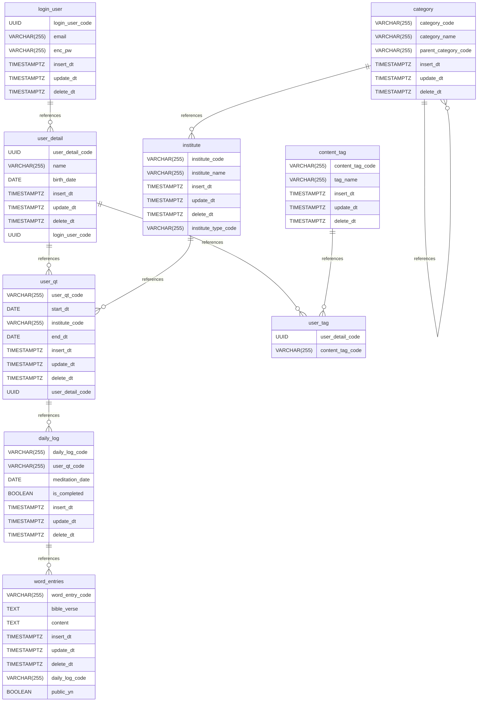

# Daily Word Log 

> **Personal Faith & Daily Meditation Tracking Web Application**  
> A mobile-friendly web application designed to capture daily Scripture verses, personal reflections, and prayer notes—helping users track spiritual growth and keyword trends over time.

---

## Background & Motivation
- **The Problem:** Writing quiet time (QT) notes in physical notebooks often leads to forgotten insights and lost momentum. Existing apps often enforce rigid single-entry limits or fixed daily devotionals.
- **The Solution:** A flexible, user-driven digital log where users can record **unlimited Scripture entries** per day, attach custom QT sources or book covers, tag key themes (e.g., `#Grace`, `#Obedience`), and visualize spiritual growth patterns via a summary dashboard.

---

## 🛠️ Tech Stack & Architecture

### Frontend
- **Framework:** React.js
- **Styling:** Tailwind CSS (Mobile-first responsive design)
- **State Management:** React Context API / Zustand

### Backend & Database
- **Database:** PostgreSQL
- **Authentication:** Supabase Auth / JWT
- **Storage:** Cloud Storage for devotional book cover images & notes

---

## Database Schema (PostgreSQL DDL)

